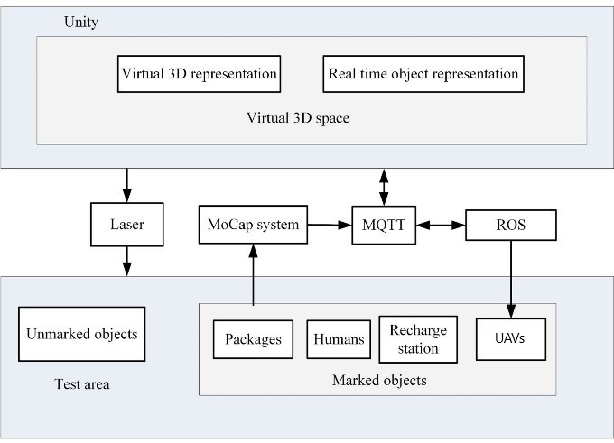

# UAVs for Industries and Supply Chain Management [[MHCL 2022](https://arxiv.org/abs/2212.03346)]

This work aims at showing that it is feasible and safe to use a swarm of Unmanned Aerial Vehicles (UAVs) indoors alongside humans. UAVs are increasingly being integrated under the Industry 4.0 framework. 
UAV swarms are primarily deployed outdoors in civil and military applications, but the opportunities for using them in manufacturing and supply chain management are immense. There is extensive research on 
UAV technology, e.g., localization, control, and computer vision, but less research on the practical application of UAVs in industry. UAV technology could improve data collection and monitoring,
enhance decision-making in an Internet of Things framework and automate time-consuming and redundant tasks in the industry. However, there is a gap between the technological developments of UAVs and their 
integration into the supply chain. Therefore, this work focuses on automating the task of transporting packages utilizing a swarm of small UAVs operating alongside humans. MoCap system, ROS, and unity are used 
for localization, inter-process communication and visualization. Multiple experiments are performed with the UAVs in wander and swarm mode in a warehouse like environment.

https://github.com/user-attachments/assets/b4f319a2-ae60-4465-bb01-18a791da08a8

# Architecture
The architecture used to implement the scenario shown in above video. 

    

